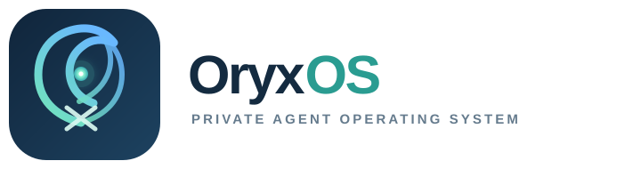
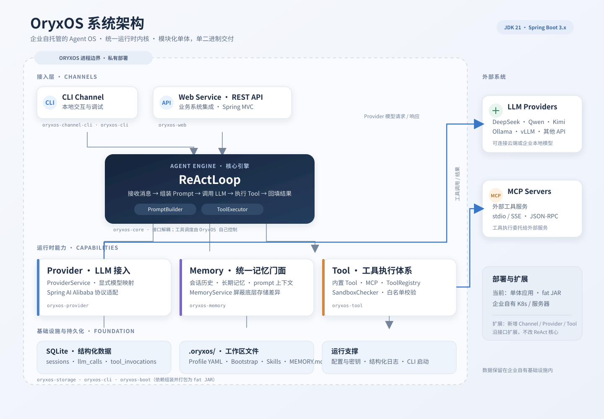

<p align="center">
  
</p>

# OryxOS

> 一个企业能完全掌控的、**Java 原生**的、私有可审计的 Agent 统一底座。
OryxOS 是一个基于 Java 的企业级 Agent OS。它装在企业自己的 K8s、服务器或物理机上，作为统一底座，在底座上跑各种业务 Agent（运维助手、客服助手、HR 助手、销售助手、知识管理助手等），共享一套渠道接入、模型路由、工具调用、记忆系统、沙箱执行能力。**数据完全留在企业自己的基础设施，不锁任何云生态。**

- **统一**：多个业务 Agent 共享一套底座，公共能力下沉，上一个新 Agent 只需配一份 Profile。
- **私有**：数据与部署完全在企业自己手里，模型可接外部 API 也可用本地 Ollama / vLLM。
- **易接入**：标准 Spring Boot 工程，跟企业现有 Java 体系直接对接，Tool 用 MCP 任何语言都能写。
- **可观测**：结构化日志、健康检查、Prometheus 指标，适配企业现有监控告警体系。

---

## 为什么需要 OryxOS

业界开源 Agent 生态已有两个代表性项目：**OpenClaw**（Node.js，偏个人）和 **Hermes Agent**（Python，偏个人到小团队）。但 Java 生态里没有任何一个项目把"Agent OS"作为定位——而 Java 恰恰是大量企业现有后端的事实标准。

严监管企业（银行、政府、电信、能源、医疗）需要私有部署、完全可审计、能纳入现有 IT 治理、跟现有技术栈对齐的 Agent 底座。OryxOS 填的就是这个位置：**Java 原生、装好就跑、可审计、能进企业现有安全审查流程的 Agent 运行时**。

| | OpenClaw | Hermes Agent | OryxOS |
|---|---|---|---|
| 语言 | Node.js | Python | **Java / Spring Boot** |
| 定位 | 个人、开发者优先 | 个人到小团队 | **企业场景（严监管行业）** |
| 私有可审计 | 弱（需二次加固） | 部分 | **Day one 设计** |
| 多租户 / SSO / 完整审计 | 空白 | 空白 | **扩展阶段补齐（核心能力之一）** |
| 企业 Java 体系对接 | 需要胶水代码 | 需要胶水代码 | **原生对齐** |

OryxOS 与 OpenClaw、Hermes 同类不同定位，三者通过 SKILL.md 标准互通，生态互补不竞争。

---

## 核心特性

### 五大核心能力

| 能力 | 说明 |
|---|---|
| 🤖 对接 LLM | Provider 抽象层，对接 DeepSeek、通义、Kimi、智谱、混元、豆包、Anthropic、OpenAI 等主流模型，Agent 不感知具体调用哪家，运行时切换无 lock-in |
| 🔄 ReAct 循环 | 自实现的 Agent 核心循环（Reason + Act），LLM 自主决定何时调用工具、看结果、再决策，直到给出最终响应，支持多步骤任务 |
| 🧠 Memory 三层记忆 | 会话记忆（SQLite 持久化）+ 长期记忆（MEMORY.md，`save_memory` / `recall_memory`），跨对话记住用户偏好、项目背景、关键决策 |
| 🛠 Tool 体系 | 内置 Tool（文件、Shell、HTTP）+ Plugin Tool 三档接入：SKILL.md + MCP **零代码**、自写 MCP server **轻代码**、`@Tool` 注解 **重代码** |
| 🌐 Web Service | 完整 REST API 对外暴露所有能力，业务系统通过 HTTP 接入，是企业把 AI 能力嵌入已有系统**唯一通道** |

### 企业级基因（Day one 设计）

- **审计落库**：每次 LLM 调用和 Tool 调用写入 SQLite 审计表（`llm_calls` / `tool_invocations`），可审计的数据地基从第一行代码就立起来。
- **沙箱白名单**：文件路径、Shell 命令、HTTP 域名三层白名单校验，应用层隔离工具执行边界（不用已废弃的 SecurityManager）。
- **凭证不落地**：API key 通过环境变量或独立配置加载，不明文写死在 Profile 里。
- **单二进制部署**：JDK 21 + Spring Boot 3.x 单体应用，`mvn clean package` 打出一个 fat JAR，装一个 Spring Boot 应用一样自然。

---

## 架构总览



### 模块划分（Maven 9 模块）

| 模块 | 职责 |
|---|---|
| `oryxos-core` | 核心引擎：`ReActLoop`、`PromptBuilder`、`ToolExecutor`、`ContextLoader`、Session、Profile、OryxTool 抽象 |
| `oryxos-provider` | `ProviderService`、Function Calling 适配、provider name 映射 |
| `oryxos-memory` | `MemoryService` 三层统一门面、`LongTermMemory`、`MemoryTools` |
| `oryxos-tool` | 内置 Tool（File/Shell/Http）、MCP Client、`ToolRegistry`、`SandboxChecker` |
| `oryxos-web` | `WebServer`、六个 ApiController、`GlobalExceptionHandler`、OpenAPI |
| `oryxos-channel-cli` | CLI Channel 实现 |
| `oryxos-storage` | SQLite 存储层：`sessions`、`tool_invocations`、`llm_calls` 三张表 |
| `oryxos-cli` | Picocli 命令行入口（12 个子命令） |
| `oryxos-boot` | Spring Boot 启动模块，打成 fat JAR |

模块依赖链：`core`（基座）→ `provider` / `memory` / `tool` / `storage` / `channel-cli`（依赖 core）→ `web` / `cli`（聚合）→ `boot`（fat JAR）。扩展阶段新增 Channel / Tool 只加新模块，不改 core。

### 工作区结构

```
.oryxos/
├── profiles/          # Agent 配置（每个 Agent 一个 YAML）
├── sessions/          # 会话历史
├── skills/            # SKILL.md 技能文件
├── tools/             # 自定义 Tool 配置
├── logs/              # 结构化日志
├── memory/
│   └── MEMORY.md      # 长期记忆
├── AGENTS.md          # Bootstrap：项目级 agent 行为说明
├── SOUL.md            # Bootstrap：agent 人格定义
├── USER.md            # Bootstrap：用户偏好
├── mcp_servers.yaml   # MCP server 配置
└── oryxos.db          # SQLite 数据库
```

---

## 快速开始

> ⚠️ 项目当前处于规划阶段（文档就绪，1.0 代码按 4 周核心阶段实施中），以下为 1.0 目标用法。

### 前置要求

- JDK 21+
- Maven 3.9+

### 安装

```bash
git clone https://github.com/your-org/oryxos.git
cd oryxos
mvn clean package
```

### 初始化工作区

```bash
java -jar oryxos-boot/target/oryxos.jar init
```

在当前目录创建 `.oryxos/` 工作区：五个子目录、三个 Bootstrap 文件（`AGENTS.md` / `SOUL.md` / `USER.md`）、一份默认 Profile。

### 配置 Provider

通过环境变量注入 API key：

```bash
export DEEPSEEK_API_KEY=sk-xxxx
```

### 与 Agent 对话

```bash
java -jar oryxos-boot/target/oryxos.jar chat
```

```text
你 > 查一下北京天气并告诉我穿什么
Agent: 北京今天 24°C，多云，适合穿薄长袖或短袖加外套……
```

Agent 会通过 ReAct 循环自主调用 HTTP Tool 拉取天气数据，再基于数据给出穿衣建议。

### 启动 HTTP 服务

```bash
java -jar oryxos-boot/target/oryxos.jar serve
# 默认监听 8080 端口
```

---

## 配置示例

一个 Profile 对应一个 Agent，用 YAML 描述：

```yaml
# .oryxos/profiles/ops-assistant.yaml
name: ops-assistant
description: 企业运维助手
identity:
  agent_name: 运维小助手
  prompt: 你是企业运维助手，负责告警分诊、日志查询、服务重启，回复简洁专业。
provider:
  name: deepseek
  model: deepseek-chat
tools:
  - http_get
  - shell
  - read_file
channels:
  - cli
bootstrap:
  - AGENTS.md
  - SOUL.md
  - USER.md
settings:
  max_iterations: 10
```

### 零代码扩展：SKILL.md + MCP

业务方想加一个"每日 PR digest"场景，不用写一行代码：

1. 写一份 `daily-pr-digest.md` 描述任务和触发时机，放到 `.oryxos/skills/`；
2. 在 `mcp_servers.yaml` 里配置社区现成的 `github-mcp` 和 `slack-mcp`；
3. Profile 引用这个 Skill 和两个 MCP server —— 完成。

LLM 读到 SKILL.md 后自己理解任务、自己组合调用 MCP 工具。

---

## REST API（核心 10 端点）

| 端点 | 说明 | 分类 |
|---|---|---|
| `POST /api/v1/sessions` | 创建会话 | 会话管理 |
| `POST /api/v1/sessions/{id}/messages` | 发消息 | 会话管理 |
| `GET /api/v1/sessions/{id}` | 查询会话历史 | 会话管理 |
| `DELETE /api/v1/sessions/{id}` | 归档会话 | 会话管理 |
| `POST /api/v1/agents/{name}/invoke` | Agent 无状态调用 | Agent 调用 |
| `GET /api/v1/profiles` | 列 Profile | 信息查询 |
| `GET /api/v1/memory` | 查长期记忆 | 信息查询 |
| `GET /api/v1/tools` | 列可用 Tool | 信息查询 |
| `GET /api/v1/health` | 健康检查 | 系统状态 |
| `GET /api/v1/info` | 系统信息 | 系统状态 |

```bash
# 创建会话
curl -X POST http://localhost:8080/api/v1/sessions \
  -H "Content-Type: application/json" \
  -d '{"profile_name": "ops-assistant"}'

# 发消息
curl -X POST http://localhost:8080/api/v1/sessions/{id}/messages \
  -H "Content-Type: application/json" \
  -d '{"content": "查看生产环境 CPU 使用率"}'
```

---

## 命令行工具（12 个子命令）

```text
oryxos init                      初始化工作区
oryxos status                    查看配置和运行状态
oryxos chat                     交互式多轮对话（--profile 指定 Agent）
oryxos serve                    启动 HTTP API 服务
oryxos gateway                  启动多渠道守护进程
oryxos profile list             列出所有 Profile
oryxos profile create <name>    创建 Profile
oryxos profile show <name>      查看 Profile 详情
oryxos profile delete <name>    删除 Profile
oryxos provider list            列出已配置的 Provider
oryxos tool list                列出已注册的 Tool
oryxos session list             列出会话历史
```

---

## 路线图

### 核心阶段（OryxOS 1.0 · 运行时内核）

| 周次 | 内容 | 可演示成果 |
|---|---|---|
| 第一周 | 对接 LLM + ReAct 循环 | Agent 多轮对话并调 HTTP Tool 完成简单任务（查天气穿衣） |
| 第二周 | Memory + Tool 体系 | Agent 记住偏好、调文件读写、调外部 MCP 工具 |
| 第三周 | Web Service | 外部系统通过 10 个 REST 端点调用 OryxOS |
| 第四周 | 多 Agent + 工程化收尾 | 多 Agent 并存、CLI 完整、Session 跨重启恢复、主页可访问 |

### 扩展阶段（社区接力）

多 Channel（企业微信/飞书/钉钉/Slack）、Memory 语义检索与自动抽取、情景记忆、完整 Sandbox、Tool Policy、Provider Fallback、SSO 与多租户、完整审计、Web 仪表板、集群高可用、企业 IT 系统 connector。

### 长期方向（社区共建）

Skills Marketplace、SDK 多语言、可视化 Profile 编辑器、Kubernetes Operator、移动端管理台、Voice Channel、RISC-V 与边缘部署。

---

## 文档

| 文档 | 内容 |
|---|---|
| [docs/IndustryResearch.md](docs/IndustryResearch.md) | 业界调研：Agent OS 格局、Java 生态缺位、OryxOS 定位 |
| [docs/DeamandAnalysis.md](docs/DeamandAnalysis.md) | 需求文档：五大核心能力、功能/扩展/社区共建三档分级、验收标准 |
| [docs/TechnicalSolution.md](docs/TechnicalSolution.md) | 技术方案：关键技术决策、四层架构、9 模块、数据持久化 |
| [docs/AiProgrammingGuide.md](docs/AiProgrammingGuide.md) | AI 编程实施指引：Spec-Kit 流程、5 个 user story 拆解 |

---

## 贡献

OryxOS 以开源社区方式长期维护。

- 核心扩展功能（多 Channel、Memory、Tool Policy）由项目维护方保持基本投入；
- 社区共建功能（Marketplace、可视化编辑器、移动端）欢迎社区贡献者认领。

主仓库 issue 会标注 `good-first-issue`、`feature-request`、`long-term-goal`，方便社区贡献者找到合适的切入点。

> 增量阶段的小改动（加一个 Channel、修一个 Bug、加一个 Plugin Tool）不需要走完整 Spec-Kit 流程，直接用 Claude Code 改完提 PR 即可。

---

## 开源协议

开源协议待定，以项目仓库 `LICENSE` 文件为准。

---

## 联系方式

- 项目主页：https://oryxos.qqtang.cloud
- GitHub：https://github.com/txw-github/oryxos
